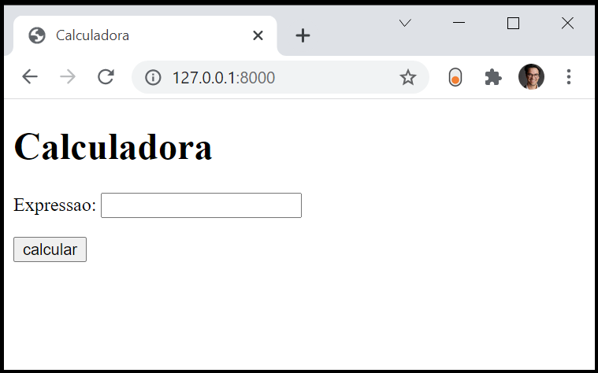

# calculadora

Esta aplicação mostra como se implementa uma página que recolhe informação num formulário, faz seu processamento no back-end, e retorna um resultado associado.

Passos: 
1. Cria-se formulário no [template](https://github.com/CR-21-22/calculadora/blob/main/calculadora/templates/calculadora/index.html), com input para uma expressão matemática. 
2. No ficheiro [views.py](https://github.com/CR-21-22/calculadora/blob/main/calculadora/views.py), cria-se view que que renderiza o template. Caso seja submetido o formulário via mensagem HTTP post, extrai a expressão enviada e avalia o resultado. Retorna no contexto a expressão e o resultado.
3. O template [template](https://github.com/CR-21-22/calculadora/blob/main/calculadora/templates/calculadora/index.html) será usado para, fora do form, apresentar a expressao matemática e seu resultado.

https://user-images.githubusercontent.com/42048382/143500089-452e00d1-d95a-47e4-baac-cf1851796bf1.mp4

